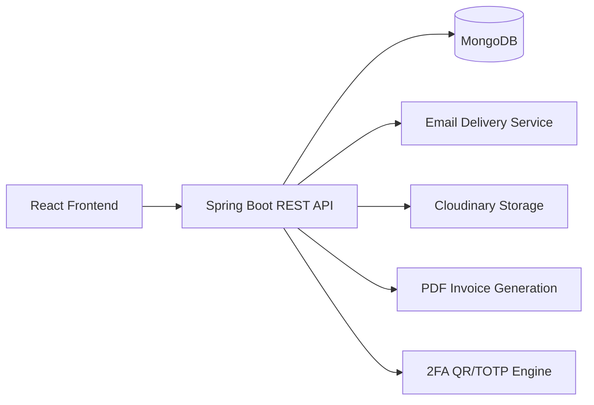

# KavyaProMan 360
## Professional Project Report

Additional formats:
- University submission version: [REPORT_UNIVERSITY_SUBMISSION.md](REPORT_UNIVERSITY_SUBMISSION.md)
- Client presentation version: [REPORT_CLIENT_PRESENTATION.md](REPORT_CLIENT_PRESENTATION.md)
- Viva Q&A version: [REPORT_VIVA_QA.md](REPORT_VIVA_QA.md)

### Document Information
| Field | Details |
|---|---|
| Project Title | KavyaProMan 360 - Enterprise Project Management Platform |
| Report Type | Professional Technical Project Report |
| Architecture | Full-stack web application |
| Frontend | React + Vite |
| Backend | Spring Boot + Java |
| Database | MongoDB |
| Prepared By | Pratik Gawre, Vaibhav Kubde, Jayashri sonawane |

---

## 1. Executive Summary
KavyaProMan 360 is an end-to-end project and team management system designed to manage software delivery from onboarding to release planning. The platform supports authentication with OTP and optional 2FA, organization and team setup, project and sprint lifecycle handling, issue tracking through board/backlog workflows, analytics reporting, notification management, and subscription/payment operations.

The system follows a clear lifecycle:
1. User identity verification and secure access.
2. Workspace setup through organization creation.
3. Team formation and role assignment.
4. Project creation with member mapping.
5. Sprint planning and issue lifecycle execution.
6. Continuous monitoring through reports and dashboard summaries.
7. Commercial operations via subscription and payment modules.

---

## 2. Problem Statement and Objective
### Problem
Teams typically use disconnected tools for authentication, team management, task tracking, reporting, and billing. This causes low visibility, weak accountability, and slow planning cycles.

### Objective
Build a single integrated platform that:
- Provides secure authenticated access.
- Supports role-based collaboration.
- Tracks project execution from backlog to completion.
- Produces actionable reporting metrics.
- Handles subscription and payment workflows in the same ecosystem.

---

## 3. Scope of the System
### In Scope
- User registration, login, OTP verification, forgot/reset password, optional 2FA.
- Organization creation/customization.
- Team and member management with role governance.
- Project CRUD, project team linking, and archive controls.
- Issue CRUD, comments, attachments, labels, priorities, status movement.
- Sprint planning, start/complete workflow, and sprint issue summaries.
- Dashboard and report analytics.
- Notifications and user preference management.
- Plan/subscription management and payment/invoice support.
- Contact Sales workflow with email verification and attachment support.

### Out of Scope
- OAuth token/JWT based session system (current flow uses `X-USER-ID` header for API identity in app mode).
- Multi-region deployment and distributed cache orchestration.
- Native mobile client.

---

## 4. System Architecture
### 4.1 Logical Architecture

### 4.2 Runtime Flow
1. Frontend captures user intent (login, create issue, start sprint, update plan).
2. Frontend sends REST call to backend (`/api/...`).
3. Backend validates payload and user context (`X-USER-ID` where required).
4. Service layer applies business rules (role checks, workflow constraints, validation).
5. Repository layer persists to MongoDB.
6. Backend returns structured response.
7. Frontend updates state and UI to reflect latest result.

---

## 5. Role-Based Access and Behavior
| Role | Key Access | Expected Result |
|---|---|---|
| Admin | Admin dashboard, user role changes, pending request actions, manager-team visibility | Governance-level control over users, requests, and portfolio overview |
| Project Manager | Project ownership, team alignment, issue visibility, sprint execution | Coordinated planning and delivery tracking for projects |
| Developer | Issue execution, board updates, issue comments | Work progress updates and delivery throughput |
| Tester | Review-stage participation, reviewer assignment constraints | Structured QA flow and controlled review completion |

---

## 6. End-to-End Project Flow (How the Project Works)

## 6.1 Flow A - User Onboarding and Secure Login
| Step | User/System Action | Backend Processing | Result |
|---|---|---|---|
| 1 | User submits registration form | `/api/auth/register` validates corporate email domain and uniqueness | User account created with OTP |
| 2 | OTP is sent to email | Email service dispatches verification code | User receives verification OTP |
| 3 | User enters OTP | `/api/auth/verify-otp` validates code against stored verification code | Account marked verified |
| 4 | User logs in with credentials | `/api/auth/login` validates password and issues OTP (or requests 2FA if enabled) | Secondary verification required |
| 5 | User verifies login OTP or TOTP | `/api/auth/verify-otp` or `/api/auth/verify-2fa` validates second factor | Session user identity established in frontend context |

Expected operational result: only verified users can complete login flow and access workspace pages.

---

## 6.2 Flow B - Organization Setup
| Step | Action | System Result |
|---|---|---|
| 1 | Authenticated user opens create organization page | Organization form with slug, name, description is available |
| 2 | User submits details | `/api/organizations` creates organization record with ownership metadata |
| 3 | UI stores/loads organization context | Organization-scoped queries start filtering projects/members |

Expected operational result: all downstream project/team operations become workspace scoped.

---

## 6.3 Flow C - Team Formation and Member Governance
| Step | Action | Backend Rule | Result |
|---|---|---|---|
| 1 | Manager invites member | `/api/members` creates or updates member in manager/org context | Team member record available |
| 2 | User email is verified from directory search | `/api/users/verify-email` and `/api/users/search` assist invite mapping | Accurate user-member linking |
| 3 | Admin updates role when required | `/api/admin/users/{id}/role` with admin validation | Role rights updated in system |
| 4 | Pending join/role requests reviewed | `/api/admin/pending-requests/*` handles approval/rejection | Controlled membership transitions |

Expected operational result: correct team composition with controlled authorization boundaries.

---

## 6.4 Flow D - Project Creation and Assignment
| Step | Action | Backend Rule | Result |
|---|---|---|---|
| 1 | Manager creates project | `/api/projects` enforces project key + manager uniqueness and validates required fields | New project is created |
| 2 | Project members are mapped | Team members are normalized/deduplicated by service layer | Clean project-member roster |
| 3 | Project becomes visible by filters | Query supports manager/member/organization filters | Correct project list per user scope |
| 4 | Project updates and archival performed | `/api/projects/{id}` update/delete/archival logic applied | Project lifecycle remains maintainable |

Expected operational result: each project has unique key semantics and clean ownership/team mapping.

---

## 6.5 Flow E - Sprint Planning and Activation
| Step | Action | Backend Rule | Result |
|---|---|---|---|
| 1 | User creates sprint in backlog | `/api/sprints` validates project key + sprint name | Sprint saved as `planned` by default |
| 2 | Sprint start initiated | `/api/sprints/{id}/start` ensures no other active sprint in same project | Exactly one active sprint at a time |
| 3 | Issues associated to sprint | Issues with `sprintId` contribute to sprint summary | Sprint shows counts by status/assignee |
| 4 | Sprint completion | `/api/sprints/{id}/complete` closes sprint and sets completion metadata | Sprint transitions to `completed` |

Expected operational result: controlled sprint execution with conflict prevention and summary visibility.

---

## 6.6 Flow F - Issue Lifecycle (Backlog to Done)
| Step | Action | Backend Processing | Result |
|---|---|---|---|
| 1 | Issue created from dashboard/backlog/board | `/api/issues` normalizes status, priority, points, assignee, keys | Traceable issue entry created |
| 2 | Issue status updated on board | `/api/issues/{id}` updates status (`todo/progress/review/done`) with role checks | Work item moves through lifecycle |
| 3 | Reviewer assignment handled | Tester review rules enforced in service layer | Review ownership remains controlled |
| 4 | Comments/attachments added | `/api/issues/{id}/comments` validates message and appends comment artifacts | Collaboration evidence captured |
| 5 | Notifications generated | Assignment/status/comment events trigger notification creation | Stakeholders receive actionable updates |

Expected operational result: complete issue traceability with role-aware transition control and communication.

---

## 6.7 Flow G - Dashboard and Reporting Feedback Loop
| Step | Action | Analytics Logic | Result |
|---|---|---|---|
| 1 | Dashboard loads user/project context | Aggregates projects, issues, sprint progress, saved filters | Snapshot of current workload |
| 2 | Reports generated for selected project | `/api/reports` computes summary, velocity, burndown, distribution | Quantitative progress visibility |
| 3 | Metrics refreshed as issues move states | Completion and logged hour estimates derived from issue points/status | Decision-ready insights for managers |

Expected operational result: operational planning becomes data-driven, not assumption-driven.

---

## 6.8 Flow H - Subscription, Payment, and Invoicing
| Step | Action | Backend Processing | Result |
|---|---|---|---|
| 1 | User checks current plan | `/api/subscription/current` reads latest member subscription | Current subscription details visible |
| 2 | Payment method added | `/api/payment-methods` stores card/UPI metadata | Reusable payment options available |
| 3 | Payment confirmation submitted | `/api/payment/confirm` persists payment, updates subscription, increments plan purchase count | Plan changes become active |
| 4 | Invoice downloaded | `/api/payment/{id}/invoice` generates PDF invoice | Financial proof and audit artifact available |

Expected operational result: commercial lifecycle is integrated into operational platform usage.

---

## 6.9 Flow I - Contact Sales Workflow
| Step | Action | Validation Rule | Result |
|---|---|---|---|
| 1 | User requests verification code | `/api/contact/send-verification` checks email format and issues timed code | Verification code sent |
| 2 | User verifies code | `/api/contact/verify` validates code + expiry | Verified identity for contact request |
| 3 | User submits multipart contact form | `/api/contact/submit` validates fields, phone, attachment type/size, verification state | Contact request emailed to receiver |

Expected operational result: only verified and valid inquiry data reaches the sales mailbox.

---

## 7. Functional Modules and Expected Results
| Module | Core Functionality | Expected Result |
|---|---|---|
| Authentication | Register/login with OTP and optional 2FA | Secure account access and identity verification |
| User Profile & Settings | Profile update, notification preferences, 2FA controls | Personalized and secure user environment |
| Organization | Workspace creation and update | Scoped collaboration unit established |
| Team Management | Member invite/update/delete, role alignment | Stable team structure per project/organization |
| Project Management | Project CRUD and member mapping | Projects managed through complete lifecycle |
| Issue Management | Create/update/delete issues, status movement, comments | End-to-end issue traceability |
| Backlog & Board | Sprint-aware issue planning and execution | Transparent sprint and workflow control |
| Reporting | Summary + velocity + burndown + distributions | Objective performance monitoring |
| Notification | Read/clear/mark workflows | Timely awareness of project changes |
| Subscription & Payment | Plan selection, payment capture, invoice PDF | Managed billing with transaction proof |
| Contact Sales | Verified inquiry with optional attachments | Structured enterprise sales intake |

---

## 8. Frontend-to-Backend Mapping
| Frontend Area | Primary APIs |
|---|---|
| Login/Register/Forgot/OTP | `/api/auth/*` |
| Settings (profile + preferences) | `/api/user`, `/api/user/notifications/preferences` |
| 2FA setup/confirm | `/api/2fa/*` |
| Organizations | `/api/organizations` |
| Teams | `/api/members`, `/api/users/search`, `/api/users/verify-email`, `/api/email/send-invitation` |
| Projects | `/api/projects` |
| Dashboard | `/api/issues`, `/api/sprints`, `/api/projects`, `/api/admin/*` (admin view) |
| Board/Backlog | `/api/issues`, `/api/sprints`, `/api/members`, `/api/projects` |
| Reports | `/api/reports` |
| Notifications | `/api/notifications` |
| Subscription | `/api/subscription/current`, `/api/subscription/plans`, `/api/subscription/invoices` |
| Payment | `/api/payment/confirm`, `/api/payment/{id}/invoice`, `/api/payment-methods` |
| Contact Sales | `/api/contact/send-verification`, `/api/contact/verify`, `/api/contact/submit` |

---

## 9. Data Model Overview
| Entity | Purpose |
|---|---|
| `User` | Identity, credentials, verification state, role, profile, 2FA state |
| `Organization` | Workspace-level container for projects and members |
| `Member` | Team directory entry scoped by manager and organization |
| `Project` | Core delivery container with key, ownership, members, issue counters |
| `Sprint` | Time-bound execution window with status and issue summaries |
| `Issue` | Work unit with status, priority, assignee, reviewer, comments, sprint link |
| `Notification` | User-targeted event messages for assignments/status/comments |
| `Payment` | Transaction record for subscription purchase |
| `PaymentMethod` | Stored payment method metadata |
| `SubscriptionMember` | Active plan state for a user/org context |
| `Invoice` | Billing history reference object |
| `Plan` | Available subscription tier definition |

---

## 10. Security, Validation, and Reliability Notes
### Security Controls
- Password hashing through BCrypt.
- OTP verification for registration and login.
- Optional TOTP-based 2FA setup and verification.
- Admin endpoint access controlled by role checks.
- Contact request allowed only after code verification.

### Validation Controls
- Mandatory field validations in service/controller layers.
- Corporate email policy for registration (`@kavyainfoweb.com`).
- Attachment size/type validation for contact and issue files.
- Sprint conflict prevention (single active sprint per project).

### Reliability Behavior
- Graceful response handling with HTTP status mapping (`400`, `401`, `403`, `404`, `409`).
- Notification failures do not block issue operations.
- Data normalization for keys, roles, emails, and statuses to reduce inconsistency.

---

## 11. Deployment and Runtime Workflow
### Runtime
1. Start backend service on `http://localhost:8080`.
2. Start frontend Vite server on `http://localhost:5173`.
3. Frontend reads `VITE_API_BASE` and calls backend APIs.
4. Backend uses MongoDB for persistence and external integrations for mail/storage.

### Operational Dependencies
- MongoDB instance (local or Atlas compatible).
- Email provider setup (SendGrid/SMTP).
- Cloudinary credentials for media storage.

---

## 12. Screenshot Walkthrough

### 12.1 Authentication Entry

Expected result: user begins secure login flow and proceeds to OTP/2FA verification.

### 12.2 Registration Workflow

Expected result: valid user registration request initiates email OTP verification.

### 12.3 Dashboard Working Surface

Expected result: consolidated project activity, quick filters, and issue entry points.

### 12.4 Team Management

Expected result: searchable member workspace with role/project filters.

### 12.5 Organization Setup

Expected result: organization context created for scoped projects and members.

### 12.6 Subscription Management

Expected result: visible plan status and available upgrade options.

### 12.7 Contact Sales

Expected result: verified inquiry submission to sales team with optional attachment.

---

## 13. Measurable Outcome Expectations
| Area | Expected Outcome |
|---|---|
| Authentication | Only verified and authorized users can proceed to protected workflows |
| Team Coordination | Member-role visibility and assignment accountability increase |
| Sprint Delivery | Single active sprint governance improves iteration discipline |
| Issue Throughput | Status-driven workflow provides delivery transparency |
| Reporting | Managers get actionable weekly/project insight from velocity and burndown |
| Business Operations | Plan changes and invoice generation close billing loop inside product |
| Support Funnel | Verified contact pipeline improves quality of sales leads |

---

## 14. Conclusion
KavyaProMan 360 is implemented as a structured, role-aware project execution platform with integrated operational and business flows. The architecture supports complete lifecycle coverage from secure onboarding to delivery analytics and subscription management. The workflow design and service-layer rules ensure predictable outcomes at each step, making the platform suitable for academic demonstration as well as practical team operation.

---

## 15. Team Members
- Pratik Gawre
- Vaibhav Kubde
- Jayashri sonawane
