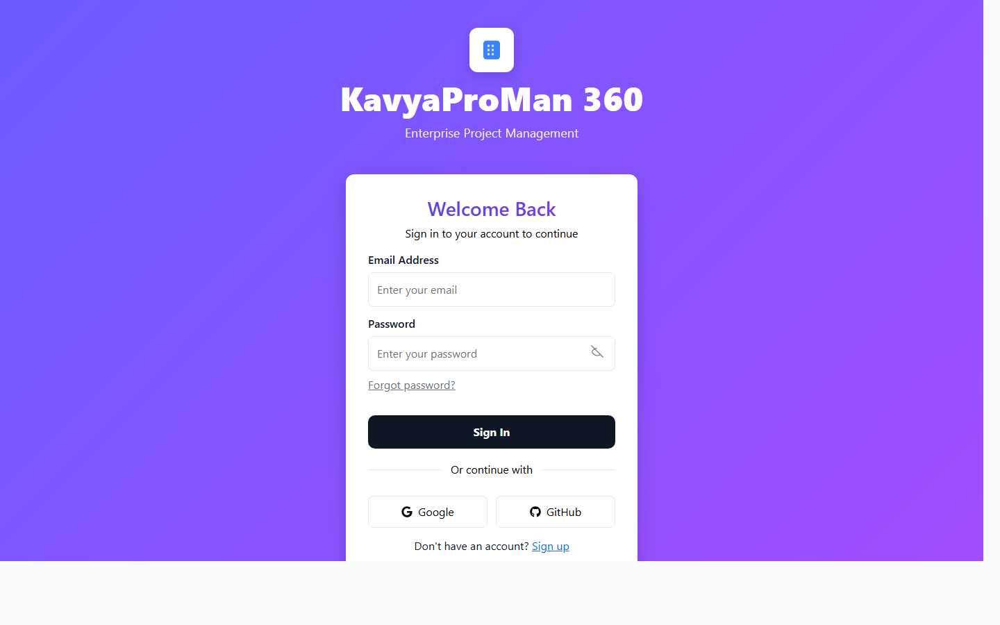
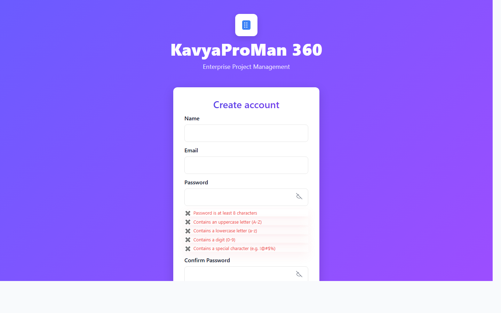
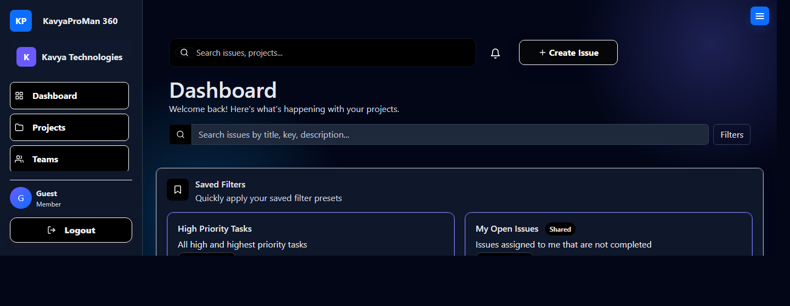
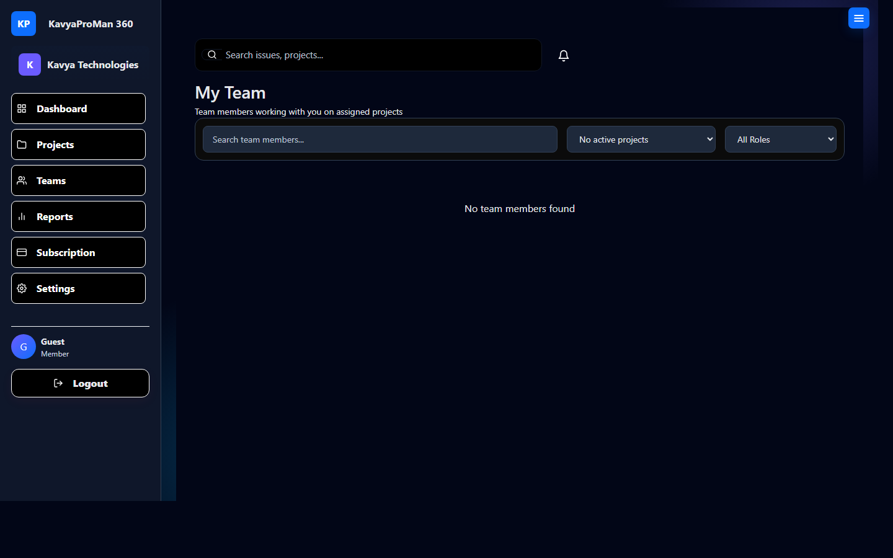
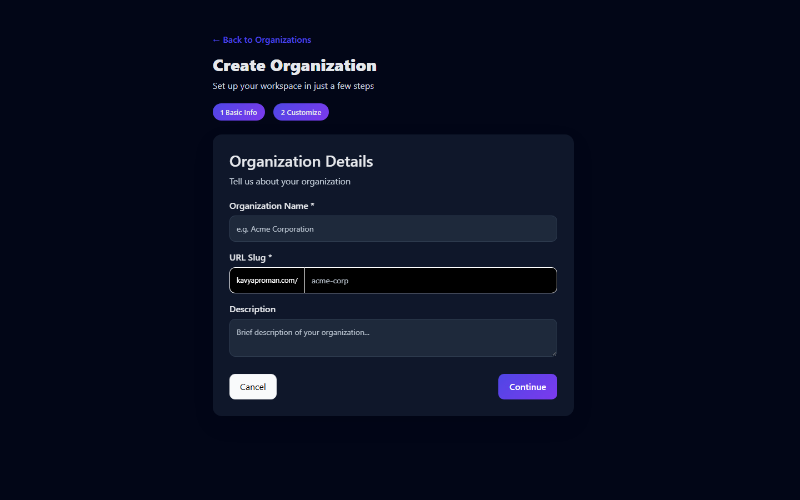
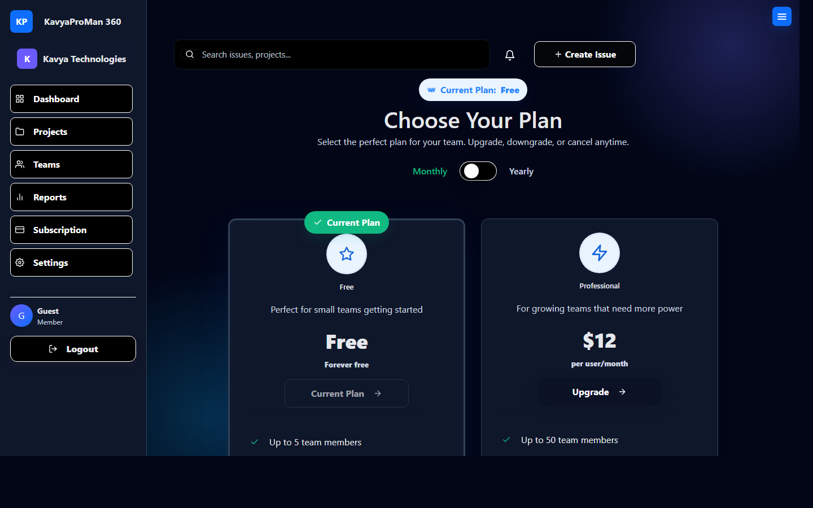
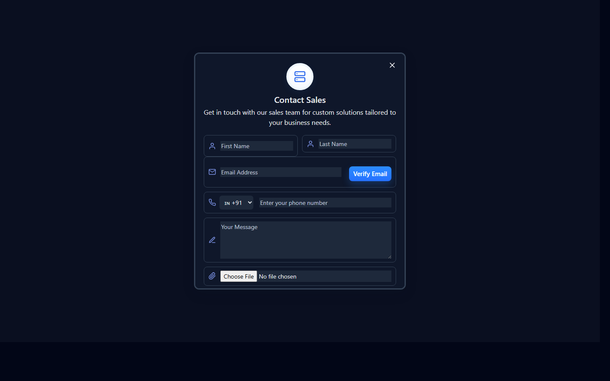

# KavyaProMan 360 - Project Documentation

For the full professional report with complete workflow, step-by-step results, and detailed module behavior, see [PROJECT_REPORT.md](PROJECT_REPORT.md).

## 1. Project Overview
KavyaProMan 360 is a full-stack project management platform for planning, tracking, and reporting software work.  
It supports team collaboration with role-based flows for Admin, Project Manager, Developer, and Tester.

## 2. Main Functionalities and Expected Result

| Functionality | Description | Expected Result |
|---|---|---|
| User Authentication | Register, login, OTP verification, forgot password, reset password, optional 2FA | Secure sign-in flow with validated user identity |
| Organization Setup | Create and customize organization details | A workspace is created and available for project/team operations |
| Team Management | Add/view members, role handling, pending requests, manager-team views | Members are mapped to teams/projects with controlled permissions |
| Project Management | Create, update, archive, and view projects | Projects are visible with project key, ownership, and current status |
| Issue Management | Create issues, filter/search, assign members, set priority/type | Issues move through lifecycle and remain traceable by project/sprint |
| Board and Backlog | Kanban board and backlog pages with status and sprint context | Teams can manage active sprint work and backlog planning efficiently |
| Sprint Management | Create/start/complete sprints | Sprint state is maintained and progress can be tracked |
| Dashboard | Saved filters, issue summaries, task insights, recent activity | Quick project health overview from a single page |
| Reports and Analytics | Metrics cards and chart-driven reporting | Team can monitor completion, effort, and issue distribution |
| Notifications | Notification list with read/clear actions | Users receive actionable updates and can manage notification state |
| Subscription and Payments | Plan listing, payment method, payment confirmation, invoices | Plan upgrades/downgrades and payment records are handled successfully |
| Contact Sales | Lead form with verification flow | Sales inquiry is captured and can be followed up by the team |

## 3. Technology Used

### Frontend
- React 19
- Vite 7
- React Router DOM
- Axios
- Recharts
- Bootstrap 5
- React Icons

### Backend
- Java 17
- Spring Boot 4.0.3
- Spring Web
- Spring Validation
- Spring Data MongoDB
- Spring Mail
- Lombok

### Database and Integrations
- MongoDB (MongoDB Atlas compatible configuration)
- SendGrid (email delivery)
- Cloudinary (file/image storage)
- ZXing (QR/2FA support)

## 4. Screenshots
The following screenshots were captured from the local running application.

### Login Screen


### Register Screen


### Dashboard Overview


### Team Management Page


### Organization Creation Flow


### Subscription and Plan Management


### Contact Sales Form


## 5. Backend API Modules (High Level)
- `/api/auth` - register, login, OTP, password reset
- `/api/2fa` - two-factor status/setup/confirm/disable
- `/api/user` and `/api/users/*` - profile, preferences, user lookup
- `/api/organizations` - organization CRUD
- `/api/projects` - project CRUD and listing
- `/api/issues` - issue CRUD and comments
- `/api/sprints` - sprint CRUD/start/complete
- `/api/reports` - analytics/report responses
- `/api/members` - member CRUD and directory operations
- `/api/notifications` - notification fetch/update/delete
- `/api/admin/*` - admin dashboard, users, pending requests, manager teams
- `/api/subscription` - plans, current subscription, invoices
- `/api/payment` and `/api/payment-methods` - payment flows and stored methods
- `/api/contact` - contact verification and submission
- `/api/uploads` - file upload endpoints

## 6. How to Run Locally

### Prerequisites
- Node.js (recommended v20+)
- Java 17
- Internet access for dependency resolution and external integrations

### Backend
```bash
cd backend
./mvnw.cmd spring-boot:run
```

Backend default URL: `http://localhost:8080`

### Frontend
```bash
cd frontend
npm install
npm run dev
```

Frontend default URL: `http://localhost:5173`

## 7. Team Members
- Pratik Gawre
- Vaibhav Kubde
- Jayashri sonawane
