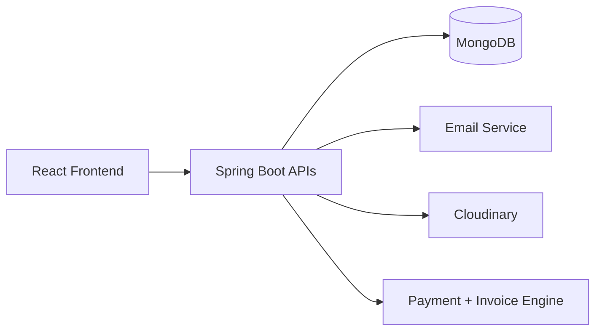

# KavyaProMan 360
## Client Presentation Report

### Team
- Pratik Gawre
- Vaibhav Kubde
- Jayashri sonawane

---

## 1. Executive Overview
KavyaProMan 360 is an integrated project execution platform that helps teams move from planning to delivery with higher visibility, role clarity, and measurable outcomes. It combines work management and commercial operations in one system:
- Team and project coordination
- Sprint and issue lifecycle tracking
- Analytics and reporting
- Subscription and payment workflow

---

## 2. Business Problem
Clients and teams often face:
- Scattered tools and data silos
- Delayed status visibility
- Inconsistent role ownership
- Weak traceability from issue creation to completion

KavyaProMan 360 solves this by providing one connected operational workspace.

---

## 3. Solution Snapshot
### Core Capabilities
- Secure onboarding with OTP and optional 2FA
- Organization and team workspace management
- Project and sprint lifecycle control
- Board/backlog issue execution with review workflow
- Dashboard and analytical reporting
- Subscription plans, payment methods, and invoice generation

### Architecture

---

## 4. How the Platform Works
| Stage | What Happens | Business Result |
|---|---|---|
| 1. User Access | Registration/login with verification | Controlled and secure access |
| 2. Workspace Setup | Organization is created and selected | Data scoped to right business unit |
| 3. Team Formation | Members added with roles | Clear accountability model |
| 4. Project Setup | Project key, members, ownership configured | Structured project ownership |
| 5. Sprint Planning | Sprint created and activated | Iteration cadence established |
| 6. Work Execution | Issues move across board states | Trackable delivery progress |
| 7. Monitoring | Dashboard and reports refresh metrics | Better management decisions |
| 8. Billing | Plan updates, payment confirmation, invoice | Commercial operations completed |

---

## 5. Functional Value by Module
| Module | Client Value |
|---|---|
| Authentication | Protects data and controls access risk |
| Team and Roles | Ensures right people have right permissions |
| Project Management | Improves planning quality and ownership |
| Sprint and Issue Workflow | Creates predictable delivery cycles |
| Reporting | Supports fast, evidence-based decisions |
| Notifications | Reduces communication lag |
| Subscription and Payment | Aligns product usage with billing process |
| Contact Sales | Improves lead quality through verification |

---

## 6. Key Differentiators
- End-to-end flow in one platform (no fragmented stack).
- Role-aware workflow from admin governance to tester review.
- Operational + commercial integration (delivery and billing together).
- Report-ready metrics for leadership visibility.

---

## 7. Expected Outcomes
| KPI Area | Expected Improvement |
|---|---|
| Delivery Transparency | Higher status visibility across teams |
| Coordination Efficiency | Faster assignment and review cycles |
| Governance | Stronger role and approval controls |
| Decision Speed | Faster actions based on dashboard/report data |
| Billing Readiness | Cleaner subscription and invoice trail |

---

## 8. Implementation Readiness
### Current Stack
- Frontend: React + Vite
- Backend: Spring Boot + Java
- Database: MongoDB
- Integrations: Email, Cloudinary, PDF invoice generation

### Deployment Readiness
- Environment-configurable backend and frontend
- Modular controllers/services for staged rollout
- Suitable for pilot teams and progressive enterprise adoption

---

## 9. Visual Walkthrough
- Login: `docs/screenshots/login.png`
- Dashboard: `docs/screenshots/dashboard-overview.png`
- Teams: `docs/screenshots/teams.png`
- Organization setup: `docs/screenshots/create-organization.png`
- Subscription page: `docs/screenshots/subscription.png`

---

## 10. Closing Statement
KavyaProMan 360 delivers a practical and scalable operational model for modern teams by connecting planning, execution, analytics, and billing in one governed platform. It is ready for demonstration, pilot deployment, and iterative enhancement based on client process maturity.

